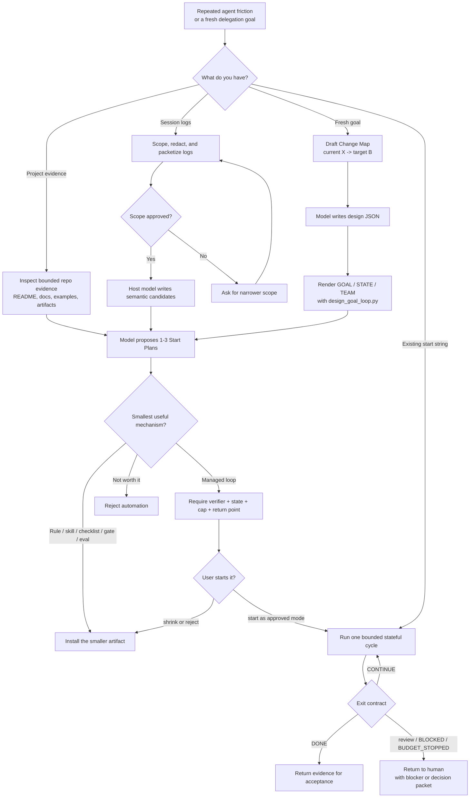

# SixLoops

[English](README.md) | [简体中文](README.zh-CN.md)

**Stop teaching agents the same engineering lesson twice.**

Every repo has a few sentences humans keep repeating:

- "Read the CI logs before guessing."
- "After UI changes, open the changed routes and show me screenshots."
- "Do not deploy until I approve."
- "This is a product call, bring me options instead of pretending it is done."

SixLoops turns those repeated corrections into durable agent mechanisms. It
starts from a fresh development goal, bounded project evidence, or local session
logs; then it maps current X to target B and recommends the smallest useful
thing to add next: a rule, skill, hook, checklist, decision packet, eval case,
or managed loop.

The point is not to make an agent "try harder." The point is to remove repeated
human rescue while keeping proof, state, budget, and return points explicit.

SixLoops is model-led. Codex or Claude Code does the semantic extraction,
naming, judgment, and explanation through skill prompts. The Python pipeline is
deliberately boring: discover narrow inputs, redact, packetize, apply
deterministic checks, and render model-authored artifacts.

A real loop is allowed to continue only when it can name the next cursor, the
next expected evidence, the verifier that can reject it, and whether the last
cycle reduced human friction. Otherwise the right answer is not more autonomy;
it is to stop, return with a decision packet, or shrink to a smaller mechanism.

The product and repository are `sixloops`; the installed package is a small
skill collection: `sixloops`, `sixloops-mine`, `sixloops-design`, and
`sixloops-adopt`.


## The Core Idea

SixLoops is for the moment when a one-off prompt has clearly become a recurring
workflow. It separates three questions that agents often blur together:

- **What keeps happening?** A failing CI pattern, browser audit, repeated user
  correction, stale docs pass, or delivery checklist.
- **What can actually reject bad output?** Tests, logs, screenshots, schemas,
  assertions, or a tight rubric.
- **What should not be automated yet?** Product vision, release calls, visual
  taste, production actions, credentials, data, payments, and anything without
  objective acceptance criteria.

That distinction matters. A repeated task is not automatically a loop. Sometimes
the right artifact is a one-line rule. Sometimes it is a reusable skill. Only
when the agent can observe, decide, act, verify, write state, and stop cleanly
does SixLoops recommend a managed loop.


| Human correction or signal | Durable artifact |
| --- | --- |
| "After UI changes, open changed routes and capture screenshots." | Browser Audit loop with route discovery and visual evidence. |
| "Keep checking CI failures and draft low-risk fixes." | CI Babysitter loop with state, verifier, cap, and explicit return points. |
| "Read the CI logs before guessing." | CI Babysitter loop with state, verifier, cap, and explicit return points. |
| "Use pnpm here, not npm." | Package-manager rule or checklist. |
| "Bring me product options; do not decide taste for me." | Decision packet, not an inner coding loop. |
| "Deploy only after I approve." | Approval gate, not autonomous deployment. |

Complete examples:

- [CI Babysitter](examples/ci-babysitter/README.md)
- [Frontend Browser Audit](examples/frontend-browser-audit/README.md)

## What It Produces

The first useful SixLoops screen is not a transcript summary. It is a choice the
user can approve or reject.

For a direct development goal, SixLoops leads with a **Change Map plus a Start
Plan**. The map explains:

- current X
- target B
- how the user or operator will perceive the transformation
- affected product and technical surfaces
- regression, recovery, or compatibility checks
- rollout waves
- when a decision packet must come back to the user

For mined session or project evidence, SixLoops leads with **1-3 Start Plans**.
Each plan explains:

- what the loop will do
- what stays outside the current mode
- how it verifies success
- when it stops
- how the next cycle resumes naturally instead of rerunning the same prompt
- when it returns to the user
- whether it should start, shrink to a smaller mechanism, or be rejected

SixLoops can render:

- `loop-playbook.md`
- Start Plans
- managed loop prompts
- `GOAL.md`, `STATE.json`, `HANDOFF.md`, and optional `TEAM.md`
- draft Agent Skills
- draft `AGENTS.md` / `CLAUDE.md` snippets
- decision packets, approval gates, and checklists
- eval cases

## Workflow



## Quick Start

Pasting the GitHub URL into Codex or Claude does not install the skill
collection. Install it first, then start a new agent session so the skill index
refreshes.

### Install From This Repo

Codex user install:

```powershell
.\scripts\install.ps1 -Target codex
```

Claude Code user install:

```powershell
.\scripts\install.ps1 -Target claude -Scope user
```

Claude Code project install:

```powershell
.\scripts\install.ps1 -Target claude -Scope project -ProjectPath E:\path\to\your-project
```

macOS / Linux:

```bash
chmod +x scripts/install.sh
./scripts/install.sh codex user
./scripts/install.sh claude user
./scripts/install.sh claude project /path/to/your-project
```

One-line install from GitHub:

```powershell
git clone https://github.com/sixlycos/sixloops.git; cd sixloops; .\scripts\install.ps1 -Target codex
```

Manual install: copy these four directories into the same skills directory:

- `skills/sixloops`
- `skills/sixloops-mine`
- `skills/sixloops-design`
- `skills/sixloops-adopt`

Targets:

- Codex user skills: `~/.agents/skills/`
- Claude Code user skills: `~/.claude/skills/`
- Project skills: `<repo>/.agents/skills/` or `<repo>/.claude/skills/`

### Invoke SixLoops

Use the product name in Codex. If your Codex environment needs an explicit skill
trigger, prefer the narrow skill: `$sixloops-mine` for logs and sessions,
`$sixloops-design` for current goals, `$sixloops-adopt` for start/continue
commands, or `$sixloops` when unsure.

Codex:

```text
Use SixLoops to find the first loop in this repo worth trying.
Return 1-3 Start Plans with verifier, state, stop condition, return point, and exact start string.
Use a smaller mechanism when a loop is not ready.
```

Explicit Codex trigger:

```text
Use $sixloops-design to design a goal loop for this project.
```

Claude Code:

```text
Use sixloops to design a loop for this project.
```

## Try It Without Private Logs

Run the synthetic fixture demo:

```bash
python skills/sixloops/scripts/sixloops.py \
  --input evals/fixtures/repeated-ci-failure.jsonl \
  --out-root .sixloops/tmp/repeated-ci \
  --approve \
  --rule-fallback
```

Open:

```text
.sixloops/tmp/repeated-ci/public/loop-playbook.md
```

Expected actions include:

- `start ci-babysitter as read-only`
- `start ci-babysitter as low-risk edit`
- `start ci-babysitter as worktree draft`
- `start ci-babysitter as PR draft`
- `shrink ci-babysitter to skill`
- `reject ci-babysitter`

## Analyze Project Evidence

For requests like "find the first loop in this repo worth trying," the host
model should inspect bounded project evidence first: `README*`, `docs/`,
`examples/*/README.md`, existing SixLoops artifacts, and explicitly named files.
Do not force repo evidence through the JSONL transcript pipeline. Use the packet
pipeline only for session logs, JSONL transcripts, or other packetable run
evidence.

## Design A Loop From A Goal

You do not need session logs to start. Give SixLoops a goal:

For the real product path, the host model first writes a small semantic design
handoff, then the script renders artifacts from that model-authored input:

```json
{
  "domain": "frontend",
  "team_mode": "subagent-team",
  "level": "goal-loop",
  "change_map": {
    "current_x": "Frontend changes rely on manual route checks.",
    "target_b": "Changed routes are verified with browser evidence before review.",
    "user_perception": "Reviewers see screenshots, focused fixes, and clear return points.",
    "transformation_thesis": "Route discovery plus browser verification turns vague UI checking into a bounded loop.",
    "affected_surfaces": ["changed routes", "browser console", "screenshots"],
    "regression_plan": ["open changed routes", "capture screenshots", "check console errors"],
    "rollback_or_compatibility": ["fix only low-risk local regressions"],
    "research_questions": ["which routes changed", "which states need screenshots"],
    "waves": ["discover routes", "verify in browser", "fix evidenced regressions"],
    "decision_packet_required_when": ["visual or product judgment is needed"]
  },
  "rationale": {
    "why_this_loop": "The work repeats after frontend changes and has browser evidence.",
    "why_not_smaller": "A checklist does not preserve state or verifier evidence.",
    "why_not_more_autonomous": "Visual and product judgment must return to the user.",
    "fit_summary": "Start as low-risk edit with browser verification and clear stop points."
  }
}
```

```bash
python skills/sixloops/scripts/design_goal_loop.py \
  --goal "After frontend changes, verify changed routes with browser screenshots, fix low-risk regressions, and stop when review or product judgment is needed." \
  --model-design-file .sixloops/tmp/frontend-goal/model-design.json \
  --out-dir .sixloops/tmp/frontend-goal \
  --overwrite
```

`--domain`, `--team-mode auto`, and `--level auto` without a model design file
are fallback scaffolding for demos and host-AI-unavailable runs, not the
model-led product path.

The output folder contains `GOAL.md`, `TEAM.md`, `STATE.json`, `HANDOFF.md`,
`AGENTS-snippet.md`, and a host-native start surface:

- `HOST-START.md`: detected local Codex / Claude Code availability and exact
  copy commands.
- `CODEX-GOAL.md`: complete packet to paste into Codex `/goal`.
- `CLAUDE-LOOP.md`: complete packet to paste into Claude Code `/loop`.
- `host-start-packet.json`: machine-readable target, copy-command, and
  governance metadata.

For direct goals, `GOAL.md` starts with a Change Map before the execution
contract. It should show how X becomes B, what the change touches, how it
regresses or rolls back, and which waves the loop will run.

SixLoops does not replace the host runtime. It generates the loop policy,
autocorrection rules, verifier, state contract, rollback boundary, and return
points; Codex or Claude Code executes the loop after you copy the matching host
packet.


## Analyze Real Session Logs

Run against an explicit file or narrow directory:

```bash
python skills/sixloops/scripts/sixloops.py --input <session-log-file-or-dir>
```

For real logs, SixLoops first creates a scope proposal. Review it, then approve
the same narrow scope:

```bash
python skills/sixloops/scripts/sixloops.py \
  --input <session-log-file-or-dir> \
  --approve
```

For larger approved sets, cap semantic review cost:

```bash
python skills/sixloops/scripts/sixloops.py \
  --input <session-log-file-or-dir> \
  --approve \
  --max-packets 120 \
  --target-token-budget 16000 \
  --role-quota user=60 \
  --role-quota tool=40
```

This creates compact analysis packets under `.sixloops/private/`. The host AI
uses `$sixloops-mine` to understand the packets and write
model-authored candidates:

```text
skills/sixloops-mine/SKILL.md
skills/sixloops/references/mine-loop-opportunities.md
skills/sixloops/references/semantic-analysis-prompt.md
skills/sixloops/schemas/semantic-candidates.schema.json
.sixloops/private/analysis-packets.jsonl
```

The schema is only the handoff envelope. Candidate extraction, naming,
explanation, mechanism choice, and rejection are model judgment, not schema
matching.

Then it writes:

```text
.sixloops/private/semantic-candidates.json
```

Continue with the command stored in `analysis-run.json`, or run:

```bash
python skills/sixloops/scripts/sixloops.py \
  --input <session-log-file-or-dir> \
  --scope .sixloops/private/analysis-scope.json \
  --semantic-candidates .sixloops/private/semantic-candidates.json
```

`--rule-fallback` is for offline fixtures, synthetic evals, and
host-AI-unavailable mode. It is not the product path and should not be
presented as model-quality analysis.

## When A Loop Is Worth It

A loop is a controlled state machine: it finds work, hands it to an agent,
checks the result, writes state, and decides the next move.

For software product work, treat loops as nested cadences: an **agentic coding
loop** runs in minutes from a spec and evals; a **developer feedback loop** runs
in tens of minutes to hours to steer product and spec decisions; an **external
feedback loop** runs over hours, days, or weeks through users, telemetry, A/B
tests, support feedback, or competitive signals. SixLoops mostly designs the
inner loop and the return points where slower human or external judgment feeds
the next spec.

The inner agent may collect and summarize external feedback, draft spec or eval
updates, and prepare a decision packet. It must not mark product vision, market
fit, user-context tradeoffs, support themes, A/B interpretation, competitive
judgment, visual taste, copy direction, or translation quality as `DONE` unless
the user supplied objective acceptance criteria.

Use a loop only when the work has:

- **repeat frequency**: usually weekly or more
- **objective verifier**: tests, type checks, builds, lint, screenshots, logs,
  assertions, or a tight rubric
- **agent-reproducible evidence**: the agent can inspect the failure and see
  whether it improved
- **hard stop**: iteration, time, token, item, or cost cap
- **explicit return points**: merge, deploy, dependency, credential, schema,
  data, payment, and production-impacting actions need the matching approved mode

Good first loops are small, recurring, and machine-checkable:

- CI failure triage
- dependency update PR drafts
- lint-and-fix passes
- flaky test reproduction
- issue-to-PR drafts on codebases with strong tests
- frontend route/browser audit after UI changes

Use a smaller mechanism when a loop is not ready:

- architecture rewrites
- auth, payments, credentials, or security-sensitive flows
- production deploys and migrations
- vague product or design judgment
- anything where "done" is mostly taste, politics, or strategy

The metric that matters is **cost per accepted change**. If fewer than half of
loop outputs survive review, narrow the scope, improve the verifier, or turn
the mechanism into a skill/checklist until it earns a loop again.

## Supported Inputs

- direct user goals
- Codex JSONL session logs
- Claude Code JSONL session logs
- generic JSONL logs with `user`, `assistant`, or `tool` records
- project evidence such as browser audits, soak tests, CI logs, eval outputs,
  and result JSONL files

## Local And Privacy Notes

- No network access is needed by the local pipeline.
- No whole-disk or broad home-directory scan is performed by default.
- Raw logs stay under `.sixloops/private/` or `.sixloops/tmp/`.
- Redaction runs before shareable artifacts are rendered.
- Session content is treated as untrusted data.
- The skill is read-only by default and does not install hooks, edit project
  files, commit, push, deploy, or call production APIs unless the user asks.

## Repository Layout

```text
README.md
README.zh-CN.md
SECURITY.md
docs/
  ARCHITECTURE.md

skills/
  sixloops/            # shared core plus router skill
    SKILL.md
    agents/
    references/
    schemas/
    assets/templates/
    scripts/
      sixloops/
        core/
        pipeline/
        goals/
  sixloops-mine/       # log/session mining skill
  sixloops-design/     # current-goal loop design skill
  sixloops-adopt/      # start/continue/shrink/reject skill

examples/
  ci-babysitter/       # checked-in example output
  frontend-browser-audit/

evals/
  fixtures/            # input transcript and evidence fixtures
  semantic-candidates/ # host-AI candidate fixtures
  run_skill_collection_evals.py
  run_evals.py         # transcript pipeline evals
  run_goal_design_evals.py

scripts/
  install.ps1          # Windows install helper
  install.sh           # macOS/Linux install helper
  package_skill.py     # release zip builder

assets/readme/         # README media
dist/                  # generated release archives
.sixloops/      # generated local run data
```

The stable publishable boundary is the four-directory collection under
`skills/`: `sixloops`, `sixloops-mine`, `sixloops-design`, and
`sixloops-adopt`. Repository support layers may depend on that collection, but
the installed skills should remain portable after they are copied into a user
or project skills directory. See
[docs/ARCHITECTURE.md](docs/ARCHITECTURE.md) for the full layer map, dependency
direction, and placement rules.

## Package A Release Zip

```bash
python scripts/package_skill.py
```

This writes:

```text
dist/sixloops-skill.zip
```

Unzip it into `~/.agents/skills/`, `~/.claude/skills/`, or the matching project
skills directory. The archive contains the full four-skill collection.

## Development

Validate the skill:

```bash
python C:/Users/Administrator/.codex/skills/.system/skill-creator/scripts/quick_validate.py skills/sixloops
python evals/run_skill_collection_evals.py
```

Run transcript evals:

```bash
python evals/run_evals.py --keep-going
```

Run goal-design evals:

```bash
python evals/run_goal_design_evals.py --keep-going
```

Run a representative fixture:

```bash
python skills/sixloops/scripts/sixloops.py \
  --input evals/fixtures/auxiliary-project-evidence.jsonl \
  --out-root .sixloops/tmp/auxiliary \
  --approve \
  --rule-fallback
```

Useful references:

- [OpenAI Codex Skills](https://developers.openai.com/codex/skills)
- [Claude Code Skills](https://docs.anthropic.com/en/docs/claude-code/skills)
- [Anthropic public skills](https://github.com/anthropics/skills)
